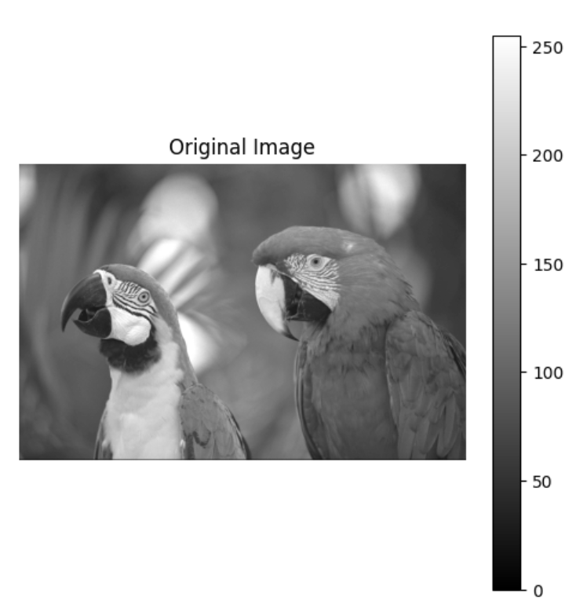
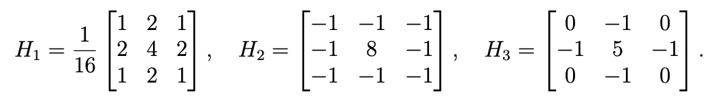
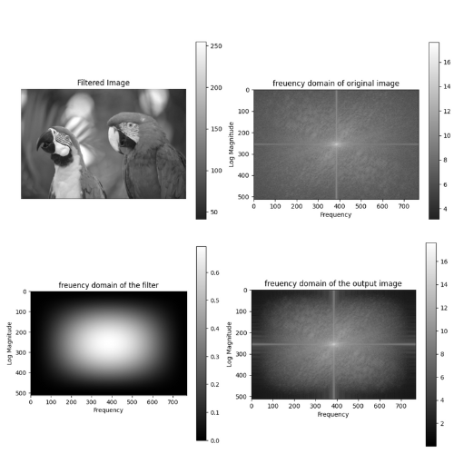
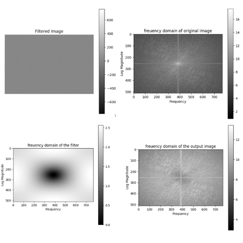
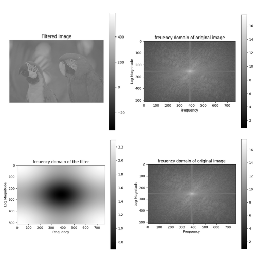

# Analyzing Filter Effects in Spatial and Frequency Domains

This project involves implementing and analyzing 2D convolution for image processing. 

The original image is as below:

First, we developed a conv2 function to perform 2D convolution with “same” padding on grayscale images, assuming filters of odd dimensions and zero-padding for pixels outside the image boundary.

Next, we use three specific filters as below:

For each of these filters, we plot the original image, the filtered image, and the log-magnitude spectrum of the original image, the filter, and the filtered image. The FFT size is matched to the image size, and grayscale colormaps with colorbars are used for visualization. The results are as below:

### H1:

It is a lowpass filter since its values sum to 1, and are all positive. The lowpass filter will result in noise removing and smoothing the image as it only passes values inside a specefic range (which can be seen as a bright circle). The results are as below:

### H2:
It is a highpass filter as its values sum to 0. The highpass filter is used for edge detection. As it can be seen from the frequency domain plots, the highpass filter only passes values outside a specefic range (which can be seen as a dark circle).

### H3: 
It is a high emphasis filter as its values sum to 1, and it contains negative values too. It is used for edge sharpening, which can also be seen from the frequency responses below:

